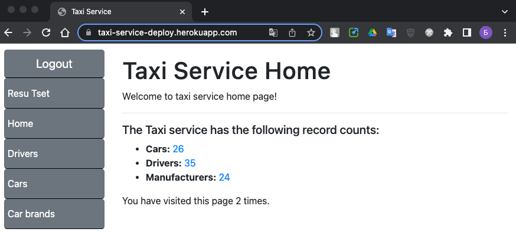
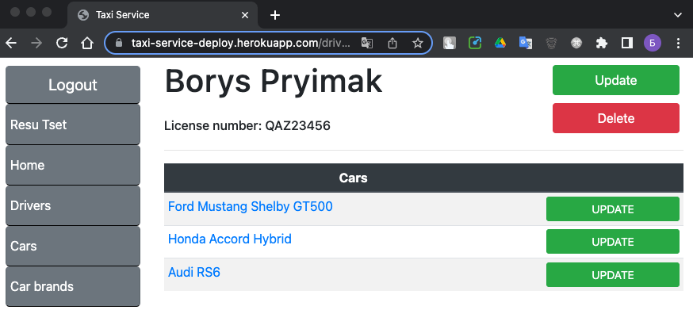
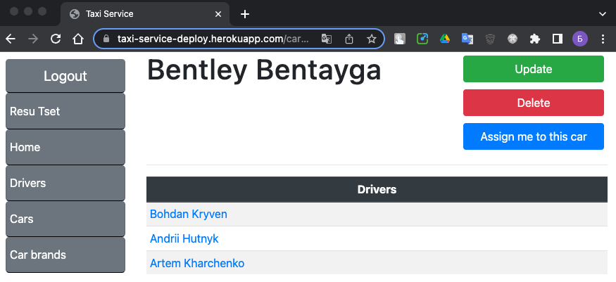
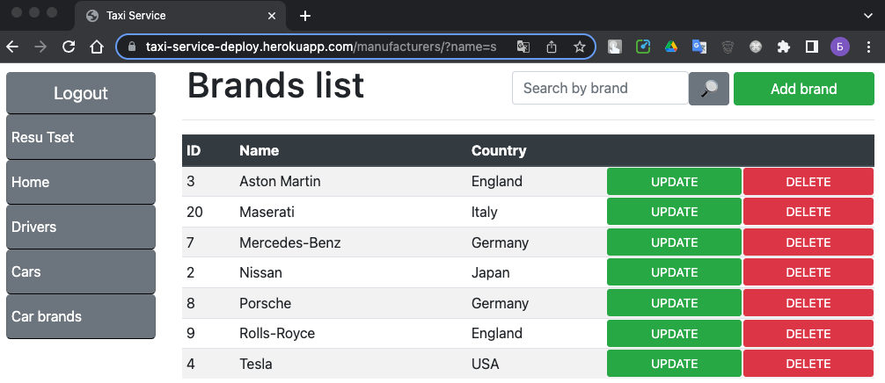

# Taxi Service
Django project of taxi service

### [>>> Deployed on Heroku <<<](https://taxi-service-deploy.herokuapp.com/)

To test this site you should use:
> - login: user
> - password: user12345

### Installing and setup

- Python3 v3.10+ must be already installed
- SQLite3 or PostgreSQL have to be installed and setup 

```shell
git https://github.com/Flashmobber/taxi-service
cd taxi-service
python -m venv venv
venv/scripts/activate
pip install -r requirements.txt
python manage.py migrate
python mange.py createsuperuser
python manage.py runserver
```

### Features

- Authentication functional for Users: model, views, templates and form for Driver objects. 
- CRUD for cars, drivers, and manufacturers directly from the website
- Powerful Django admin panel for managing DB.

### Screensots
Home screen




Driver details




Car details




Filtered brands list

